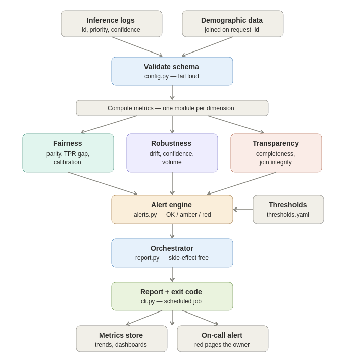

# Architecture

The system is a **validate → compute → evaluate → report** pipeline. It does not
contain or train a model — the model is the *system under observation*. This
software sits beside it, reads its inference logs, and reports on its behaviour.

## Flow

1. **Inputs** — two separate tables (inference logs and a demographic dataset),
   joined on `request_id`. They are kept apart to mirror real data governance:
   demographic data is sensitive and is joined only inside a controlled
   environment for aggregate monitoring.

2. **Validate schema** (`config.py`) — every run starts at a validation gate.
   Malformed logs fail loudly rather than producing silently wrong metrics.

3. **Compute metrics** — fans out into one module per dimension:
   - **Fairness** (`fairness.py`) — demographic parity, TPR gap, calibration gap.
   - **Robustness** (`robustness.py`) — input/output drift, confidence telemetry,
     volume and error health.
   - **Transparency** (`transparency.py`) — logging completeness, join integrity.

4. **Alert engine** (`alerts.py`) — decoupled from the metrics. It maps each
   metric to a severity (OK / amber / red) using thresholds read from
   `config/thresholds.yaml`. Thresholds are configuration, not code, so
   governance can retune them without a redeployment.

5. **Orchestrator** (`report.py`) — runs the suite and assembles one report.
   Deliberately side-effect free (no I/O, no PII logging), which makes it
   testable and embeddable in Airflow, a cron container, or a Lambda.

6. **Report + exit code** (`cli.py`) — the runnable entry point. Returns a
   non-zero exit code on a red alert so a scheduler treats a fairness or
   robustness breach as a job failure.

7. **Downstream (future scope)** — persisting results to a metrics store for
   trend alerting, and an on-call sink (Slack/email/PagerDuty) for red alerts.

## Why decoupled this way

- Metrics return numbers; alerting decides severity — each is tested in
  isolation.
- One module per dimension maps directly to the assignment's bar: *think across
  dimensions, not just implement a single metric.*
- Thresholds live in YAML so the people who own the risk, not the engineers,
  control the alerting policy.

The diagram source is in [`architecture.svg`](architecture.svg); the PNG is a
render of it for environments that don't display SVG inline.
